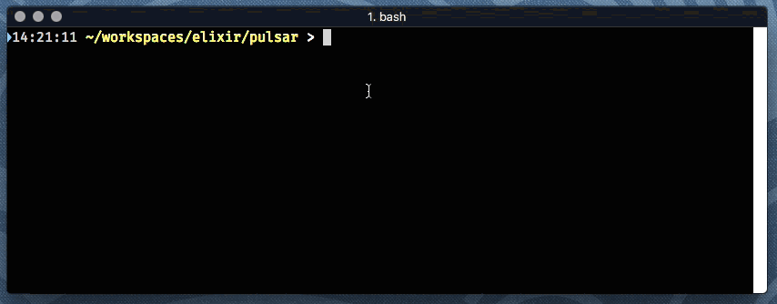

# Pulsar

[](https://hex.pm/packages/pulsar)

Writing a command line tool and want to keep the user informed about what's going on?
Too often, applications either write nothing, or overwhelm the user with logged updates.
Pulsar is used to provide just enough information to keep the user informed.

Pulsar is a text-based, dynamic dashboard that lets processes communicate their status.
Jobs can be created, updated, and completed asynchronously, and update in-place.
This is intended for use in Elixir applications that run as command line tools.



Jobs have a lifecycle: they are created, periodically updated, and eventually completed.
Whenever a job is updated, it is highlighted for one second using bright, bold text.

In the above demo, completed jobs were also set to status `:ok`, which displays them in green.

[API Documentation](https://hexdocs.pm/pulsar/api-reference.html)

## Installation

The package can be installed by adding `pulsar` to your list of dependencies in `mix.exs`:

```elixir
def deps do
  [
    {:pulsar, "~> 0.1.0"}
  ]
end
```
## Limitations

Pulsar doesn't know the dimensions of the screen; large numbers of jobs in
a short window will not render correctly.
Likewise, long lines that wrap will cause incorrect output.

Pulsar is currently hard-coded for xterm; in the future it will use the terminal capabilities
database to identify what command codes generate each effect.

Pulsar doesn't have any way to prevent other output to the console;
that will cause confusing output unless `Pulsar.pause/0` and `Pulsar.resume/0` are
used.

Pulsar works best when either all the jobs have a similar lifecycle, or
when new jobs are added and existing jobs are completed.

## Inspiration

`docker pull`.  That's it. Just wanted to have a tool that could keep me
updated, cleanly, of a reasonable number of active jobs operating
concurrently.

## License

Released under the Apache Software License 2.0.
