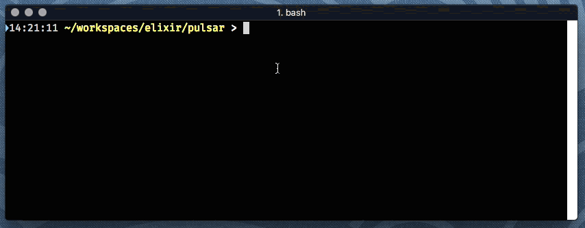

# Walmart.Pulsar

Pulsar is a text-based, dynamic dashboard that lets processes communicate their status.
Jobs can be created, updated, and completed asynchronously, and update in-place.
This is intended for use in Elixir applications that run as command line tools.



## Installation

If [available in Hex](https://hex.pm/docs/publish), the package can be installed
by adding `pulsar` to your list of dependencies in `mix.exs`:

```elixir
def deps do
  [
    {:pulsar, "~> 0.1.0"}
  ]
end
```

Documentation can be generated with [ExDoc](https://github.com/elixir-lang/ex_doc)
and published on [HexDocs](https://hexdocs.pm). Once published, the docs can
be found at [https://hexdocs.pm/pulsar](https://hexdocs.pm/pulsar).

## License

Released under the Apache Software License 2.0.
