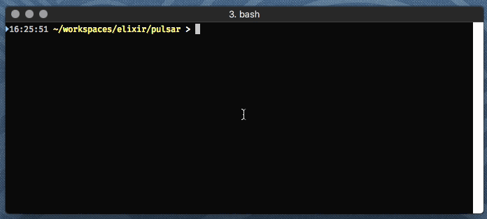

# Pulsar

[](https://hex.pm/packages/pulsar)

Pulsar is a text-based, dynamic dashboard that lets processes communicate their status.
Jobs can be created, updated, and completed asynchronously, and update in-place.
This is intended for use in Elixir applications that run as command line tools.



Jobs have a lifecycle: they are created, periodically updated, and eventually completed.
Whenever a job is updated, it is highlighted for one second using bright, bold text.

In the above demo, completed jobs were also set to status `:ok`, which displays them in green.

Completed jobs bubble up above non-completed jobs (this may change in a later release
as it can be a bit disconcerting).

[API Documentation](https://hexdocs.pm/pulsar/api-reference.html)

## Installation

The package can be installed by adding `pulsar` to your list of dependencies in `mix.exs`:

```elixir
def deps do
  [
    {:pulsar, "~> 0.1.0"}
  ]
end
```
## Limitations

Pulsar doesn't know the dimensions of the screen; large numbers of jobs in
a short window will not render correctly.
Likewise, long lines that wrap will cause incorrect output.

Pulsar is currently hard-coded for xterm; in the future it will use the terminal capabilities
database to identify what command codes generate each effect.

Pulsar doesn't have any way to prevent other output to the console;
that will cause confusing output unless `Pulsar.pause/0` and `Pulsar.resume/0` are
used.

## License

Released under the Apache Software License 2.0.
